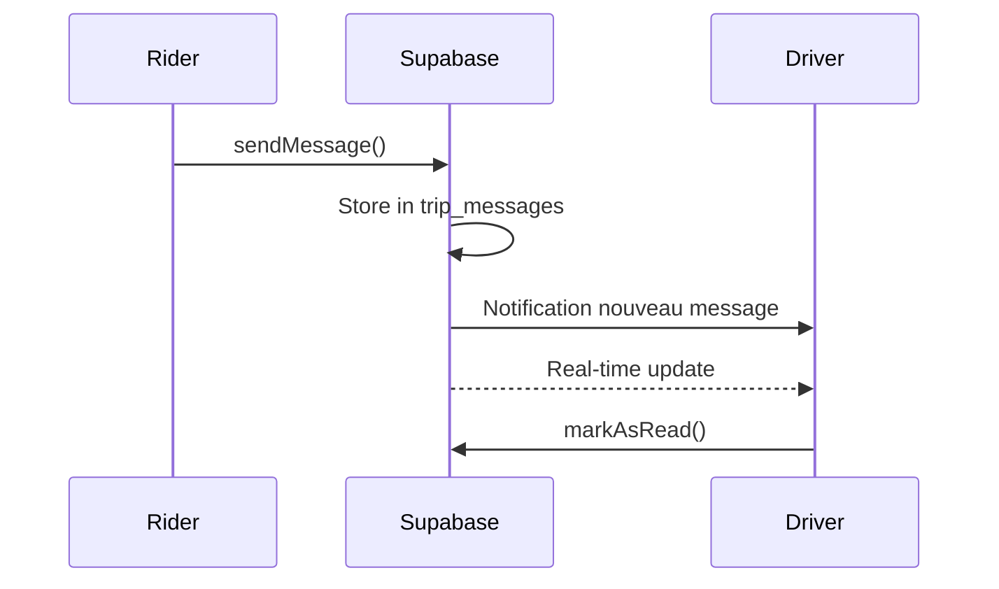

# Système d'Appel et Messagerie UUMO

## Vue d'ensemble

Ce système implémente des fonctionnalités propriétaires d'appel et de messagerie pour UUMO, permettant aux passagers et chauffeurs de communiquer sans partager leurs numéros de téléphone personnels.

## Architecture

### 1. **Appels Audio (WebRTC)**

#### Fonctionnement

- Utilise **Supabase Realtime** pour la signalisation WebRTC
- Les numéros de téléphone ne sont jamais partagés
- Connexion pair-à-pair (P2P) une fois l'appel établi

#### Tables utilisées

- `call_sessions` : Gère les sessions d'appel
- `call_signaling` : Stocke les données de signalisation WebRTC (offer, answer, ICE candidates)
- `notifications` : Notifie le destinataire d'un appel entrant

#### Flux d'appel

```mermaid
sequenceDiagram
    participant Rider
    participant Supabase
    participant Driver

    Rider->>Supabase: initiateCall()
    Supabase->>Driver: Notification appel entrant
    Driver->>Supabase: acceptCall()
    Supabase->>Rider: Appel accepté
    Rider<-->Driver: Connexion WebRTC établie
    Driver->>Supabase: endCall()
    Supabase->>Rider: Appel terminé
```

### 2. **Messagerie en Temps Réel**

#### Fonctionnement

- Messages stockés dans Supabase
- Synchronisation en temps réel avec Supabase Realtime
- Notifications push pour les nouveaux messages
- Historique conservé pendant 7 jours après la fin du trajet

#### Tables utilisées

- `trip_messages` : Stocke les messages
- `notifications` : Notifie les nouveaux messages

#### Flux de message



## Services

### CallService

**Fichiers:**

- `mobile_rider/lib/services/call_service.dart`
- `mobile_driver/lib/services/call_service.dart`

**Méthodes principales:**

```dart
// Initier un appel
Future<String> initiateCall({
  required String tripId,
  required String callerId,
  required String receiverId,
  required String callerType,
})

// Accepter un appel
Future<void> acceptCall(String callId)

// Terminer un appel
Future<void> endCall(String callId)

// Écouter les événements d'appel
Stream<Map<String, dynamic>> watchCallSession(String tripId)
```

### ChatService

**Fichiers:**

- `mobile_rider/lib/services/chat_service.dart`
- `mobile_driver/lib/services/chat_service.dart`

**Méthodes principales:**

```dart
// Envoyer un message
Future<void> sendMessage({
  required String tripId,
  required String senderId,
  required String receiverId,
  required String senderType,
  required String message,
})

// Récupérer les messages
Future<List<Map<String, dynamic>>> getMessages(String tripId)

// Écouter les messages en temps réel
Stream<List<Map<String, dynamic>>> watchMessages(String tripId)

// Marquer comme lu
Future<void> markAsRead(String messageId)

// Compter les non lus
Future<int> getUnreadCount({
  required String tripId,
  required String userId,
})
```

## Écrans

### CallScreen

**Localisation:**

- `mobile_rider/lib/features/order/presentation/screens/call_screen.dart`
- `mobile_driver/lib/features/tracking/presentation/screens/call_screen.dart`

**Fonctionnalités:**

- Interface d'appel avec avatar du contact
- Contrôles : Muet, Haut-parleur, Terminer
- Affichage de la durée de l'appel
- Gestion appels entrants/sortants

**Navigation:**

```dart
Navigator.push(
  context,
  MaterialPageRoute(
    builder: (context) => CallScreen(
      tripId: tripId,
      receiverId: receiverId,
      receiverName: receiverName,
      receiverType: 'driver', // ou 'rider'
      callId: callId,
      isIncoming: false,
    ),
  ),
);
```

### ChatScreen

**Localisation:**

- `mobile_rider/lib/features/order/presentation/screens/chat_screen.dart`
- `mobile_driver/lib/features/tracking/presentation/screens/chat_screen.dart`

**Fonctionnalités:**

- Liste des messages en temps réel
- Zone de saisie avec bouton d'envoi
- Bulles de messages stylisées
- Horodatage des messages
- Scroll automatique vers le bas

**Navigation:**

```dart
Navigator.push(
  context,
  MaterialPageRoute(
    builder: (context) => ChatScreen(
      tripId: tripId,
      receiverId: receiverId,
      receiverName: receiverName,
      receiverType: 'driver', // ou 'rider'
    ),
  ),
);
```

## Intégration dans les Écrans Principaux

### rider_tracking_screen.dart

Boutons ajoutés dans le panneau d'information du chauffeur :

```dart
// Bouton Appeler
IconButton(
  icon: Icon(Icons.phone, color: AppTheme.primaryOrange),
  onPressed: () async {
    final callId = await ref.read(callServiceProvider).initiateCall(...);
    Navigator.push(context, MaterialPageRoute(...));
  },
)

// Bouton Message
IconButton(
  icon: Icon(Icons.message, color: AppTheme.primaryOrange),
  onPressed: () {
    Navigator.push(context, MaterialPageRoute(...));
  },
)
```

### driver_navigation_screen.dart

Boutons ajoutés dans le widget `_TripDetailsCard` (section expandable) :

```dart
Row(
  children: [
    OutlinedButton.icon(
      onPressed: () async { /* Appeler */ },
      icon: Icon(Icons.phone),
      label: Text('Appeler'),
    ),
    OutlinedButton.icon(
      onPressed: () { /* Message */ },
      icon: Icon(Icons.message),
      label: Text('Message'),
    ),
  ],
)
```

## Installation Base de Données

Exécuter le script SQL dans Supabase :

```bash
psql -h [SUPABASE_HOST] -U postgres -d postgres -f create_call_messaging_tables.sql
```

Ou via le SQL Editor de Supabase Dashboard.

## Sécurité et Confidentialité

### Protection des Données

1. **Numéros de téléphone** : Jamais exposés aux utilisateurs
2. **RLS (Row Level Security)** : Activé sur toutes les tables
3. **Authentification** : Requise pour toutes les opérations
4. **Chiffrement** : Connexions HTTPS/WSS obligatoires

### Politiques RLS

- **call_sessions** : Utilisateurs ne voient que leurs propres appels
- **trip_messages** : Utilisateurs ne voient que leurs conversations
- **notifications** : Utilisateurs ne voient que leurs notifications

### Nettoyage Automatique

Fonctions disponibles pour nettoyer les anciennes données :

```sql
-- Nettoyer appels > 24h
SELECT cleanup_old_calls();

-- Nettoyer messages > 7j après fin trajet
SELECT cleanup_old_messages();

-- Nettoyer notifications lues > 30j
SELECT cleanup_old_notifications();
```

## Améliorations Futures

### Court Terme

- [ ] Implémenter réellement WebRTC (actuellement simulé)
- [ ] Ajouter support images/emojis dans les messages
- [ ] Badge de notification avec compteur de messages non lus
- [ ] Sons de notification personnalisés

### Moyen Terme

- [ ] Appels vidéo
- [] Enregistrement vocal
- [ ] Partage de position en temps réel dans le chat
- [ ] Traduction automatique des messages

### Long Terme

- [ ] IA pour modération des messages
- [ ] Transcription automatique des appels
- [ ] Analytics sur les communications
- [ ] Support multi-langue avancé

## Dépendances

Aucune dépendance externe supplémentaire requise. Le système utilise :

- `supabase_flutter` (déjà présent)
- `flutter_riverpod` (déjà présent)
- Packages standard Flutter

Pour implémenter réellement WebRTC, ajouter :

```yaml
dependencies:
  flutter_webrtc: ^0.9.47
```

## Support

Pour toute question ou problème :

1. Vérifier les logs Supabase
2. Vérifier les politiques RLS
3. Vérifier l'authentification utilisateur
4. Consulter la documentation Supabase Realtime

## Licence

Propriétaire - UUMO Platform
